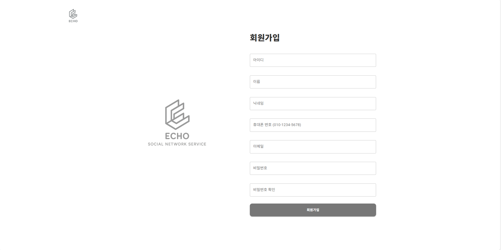

# SNS 프로젝트

## 프로젝트 소개

SNS 사이트를 만드는 개인 프로젝트를 진행했습니다.  
React를 활용해 로그인, 회원가입 기능 및 CRUD로 일상을 기록할 수 있는 웹 사이트를 만들었습니다.

## 개발 기간  
2025.05.03 ~ 2025.05.19

## 사용 기술  
### 🚀 Frontend

  
  
  
  
  

### 🛠 Backend

  
  
  
  
  

### 🧰 기타

  
  

## 주요 기능 및 화면 설명  

1. **로그인 / 로그아웃**  
- 아이디, 비밀번호 유효성 검사 및 오류 안내
- 로그인 성공 시 세션 유지(세션/로컬스토리지)
- 로그아웃 기능

2. **회원가입**  
- 아이디 실시간 중복 체크 (중복 시 안내 메시지)
- 입력값 유효성 검사(빈값, 비밀번호 규칙 등)
- 모든 정보 입력 시 회원가입 완료 

3. **메인(피드) 화면**
- 가입한 회원들의 최신 게시글 리스트 출력
- 각 게시글에 사진 첨부, 댓글 작성, 댓글 리스트 기능
- 게시글별로 좋아요, 삭제, 수정 등 기본 인터랙션 제공

4. **내 프로필/프로필 수정**  
- 내 프로필 이미지 업로드/변경 기능
- 내 정보(닉네임/소개/사진) 수정
- 내가 쓴 게시글 전체 리스트 확인
- 프로필 정보 실시간 반영
 

6. **글 작성**  
- 텍스트, 사진, 영상 첨부 지원
- 게시글 작성/수정/삭제 CRUD 구현
- 업로드 시 실시간 피드 반영

7. **DB 연결**  
- Node.js(Express) 백엔드에서 MySQL DB 연동
- 회원/게시글/댓글 데이터 관리
- Multer를 활용한 사진 파일 업로드 구현

## 프로젝트 후기  
짧은 학습 및 개발 기간이 아쉬웠지만, 기존 경험을 바탕으로 기본 CRUD 기능을 빠르게 구현할 수 있었습니다.  
React의 빠른 렌더링 장점을 체감했고, DB 연결과 파일 업로드 같은 기능도 직접 설계하여 완성할 수 있었습니다.  
앞으로 React를 더 공부해서 추가 기능을 개발해보고 싶습니다.
